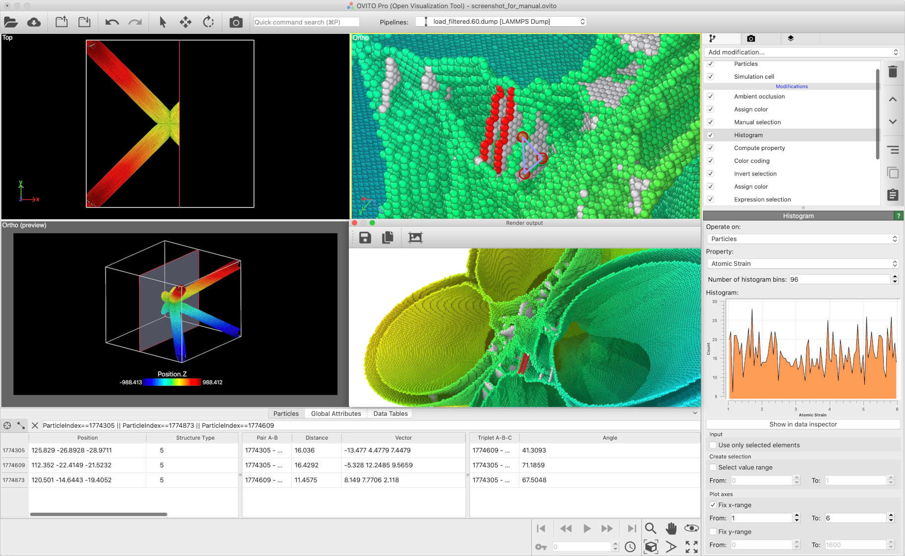

.. _about_ovito:

===========
About OVITO
===========

OVITO is a scientific data visualization and analysis software for molecular and other particle-based simulation models,
which are commonly used in computational materials science and engineering, physics, and chemistry disciplines. The software has served as a valuable
tool in `over 12,000 research publications <https://scholar.google.com/scholar?scisbd=1&hl=en&as_sdt=2005&cites=17004772467538201275&scipsc=>`__.

OVITO is a 3d graphics desktop application for Windows, Linux, and macOS. The software is being developed, distributed, and supported by `OVITO GmbH <https://www.ovito.org>`__,
a German software company founded by the original developer of OVITO, `Dr. Alexander Stukowski <http://scholar.google.com/citations?user=f8Tw3eEAAAAJ>`__,
and other team members. The ecosystem includes the :ref:`OVITO Python module <scripting_manual>`, which is available also as a standalone product free of charge.

The `first public release of OVITO <http://stacks.iop.org/0965-0393/18/015012>`__ dates back to 2009, when the software had been developed as a byproduct of a Ph.D.
project at the Materials Science Department of Technische Universität Darmstadt. For many years, OVITO remained a small, academic open-source project,
kept alive by a lot of voluntary work. Even though the software become more and more popular, the funding situation became increasingly difficult, and the
project's future was uncertain.

The key step to secure the long-term availability of OVITO for the scientific community happened in 2020: Dr. Stukowski and Dr. Kalcher founded the company
*OVITO GmbH*. The organization's long-term mission is to secure the software development, professional maintenance, and user support through
financial contributions (license fees) from OVITO users.

For more information about OVITO, please check out this user manual or visit the official website, `www.ovito.org <https://www.ovito.org>`__.