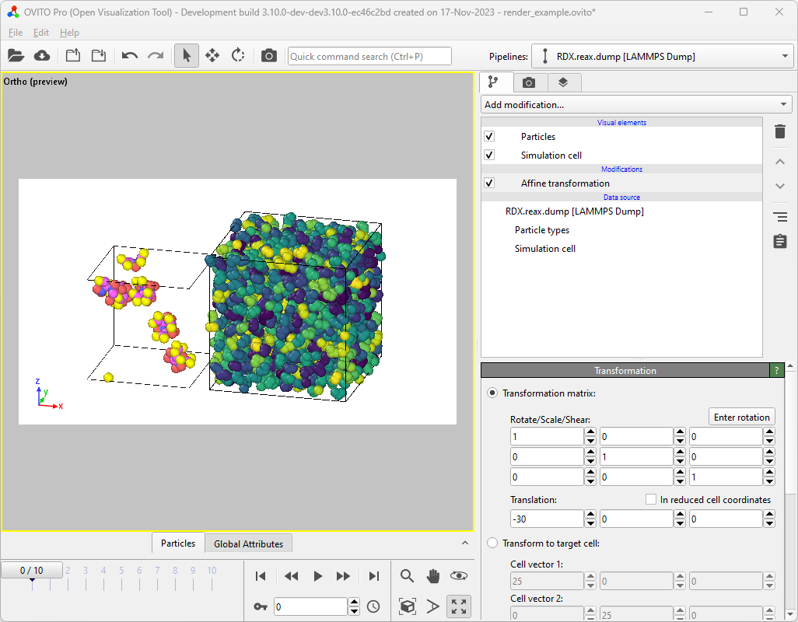
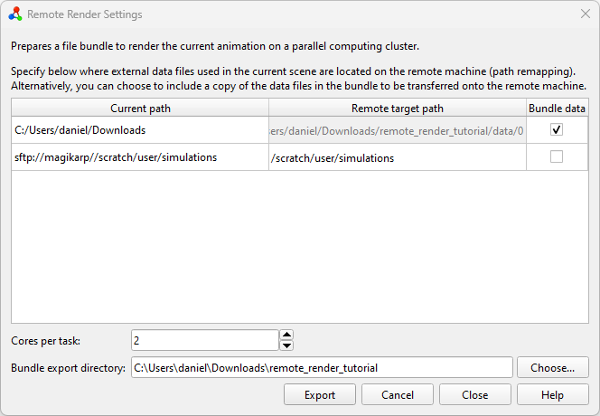

.. _tutorials.remote_rendering:
.. _howto.remote_rendering:

Remote rendering tutorial
=========================

Introduction
------------

In this tutorial, we will demonstrate how to render a video, showing multiple
simulation trajectories, on a high-performance compute cluster.
See :ref:`usage.remote_rendering` for a description of this program function,
which is available exclusively in *OVITO Pro*. By leveraging a massively parallel
computing infrastructure, we can significantly accelerate the visualization process.

*OVITO Pro* will prepare a bundle of files locally, which can then be transferred onto the
remote machine. It's crucial that all simulation files used in the visualization scene are
accessible also on the remote machine, where rendering takes place. There are two mechanisms to control this:
you can either specify the filesystem paths on the remote machine or opt to copy the
required files into the bundle.

This tutorial will cover both methods. Please note that this tutorial assumes you are running
Windows on your local desktop machine (and Linux/Unix on the remote compute
cluster). Consequently, paths and PowerShell commands may appear unfamiliar to Linux/macOS users,
but similar commands exist on all platforms.

Local setup
-----------

To follow this tutorial, you will need two sample trajectories from LAMMPS MD simulations, which can be
downloaded from a Git repository:
`RDX.reax.dump <https://gitlab.com/ovito-org/ovito-sample-data/-/raw/master/LAMMPS/RDX.reax.dump?ref_type=tags&inline=false>`__,
and
`water.unwrapped.lammpstrj.gz
<https://gitlab.com/ovito-org/ovito-sample-data/-/raw/master/LAMMPS/water.unwrapped.lammpstrj.gz?ref_type=heads&inline=false>`__.

Place the first file, ``RDX.reax.dump``, in a directory on your local desktop computer. In the following tutorial,
we'll assume the file is located at ``C:\Users\daniel\Downloads\RDX.reax.dump``.
This represents a common workflow scenario where a simulation is first performed on a
HPC cluster and then the entire output data is downloaded to the local
computer for visualization and analysis.

The second file, ``water.unwrapped.lammpstrj.gz``, will serve to demonstrate another common scenario:
you ran the simulation on a remote HPC cluster and wish to visualize and process its output data without
downloading all files to the local file system. All files stay on the cluster machine.
We will use OVITO Pro's :ref:`built-in SSH client <usage.import.remote>` to load the data over the network.
In this example scenario, the trajectory file is stored at ``/scratch/daniel/simulations/water.unwrapped.lammpstrj.gz``
on the filesystem of a compute cluster named ``magikarp``. If you are following this tutorial and have access to a
compute cluster, you should store the sample file in some directory on that cluster's filesystem.

Next, we set up the visualization scene to be rendered on the local computer. Begin by
opening the local file ``RDX.reax.dump`` and translate it by -30 angstroms in
the x-direction using the :ref:`particles.modifiers.affine_transformation` modifier -- to prevent it from overlapping with
the second dataset, which were are going to import next.

Next, use OVITO Pro's :ref:`Load remote file <usage.import.remote>`
functionality with the URL
``sftp://magikarp//scratch/daniel/simulations/water.unwrapped.lammpstrj.gz`` to import
the file from its remote location. When asked by OVITO, select :ref:`Add to scene <usage.import.multiple_datasets>`
to load the second dataset into the existing scene.

At this point, both simulation trajectories should be visible side-by-side in the viewports.
Next, you can apply modifiers as desired to build up typical visualization pipelines.
For this tutorial, we will color the water molecules by their molecule identifiers using the
:ref:`particles.modifiers.color_coding` modifier. This is also the time to configure
viewport overlays, the camera perspective, and any other settings required for a visualization.

.. image:: ../images/tutorials/remote_render/render_tab.png
    :width: 30%
    :align: left

Finally, go to the :ref:`render tab <rendering>` and configure the animation rendering options.
Since rendering on a remote computer makes the most sense when a lot of frames have to be rendered, we will select
:guilabel:`Complete animation` to render the full trajectory sequence. There is no need to
check :guilabel:`Save to file` as this option is handled automatically during the remote rendering process.
Change the renderer from :ref:`OpenGL <rendering.opengl_renderer>` (the default)
to :ref:`Tachyon <rendering.tachyon_renderer>`,
:ref:`OSPRay <rendering.ospray_renderer>`, or :ref:`VisRTX <rendering.visrtx_renderer>`.
This step can be necessary because many compute clusters do not provide
the required system environment for the OpenGL renderer to work on the compute nodes.

After configuring everything as we would for local rendering, instead of
hitting the :guilabel:`Render active viewport` button and grabbing some coffee, we
select :menuselection:`File --> Render on remote computer...` from the main menu. This
opens the *Remote render settings* dialog window.

You'll be presented with a table containing three columns (*Current path*,
*Remote target path*, and *Bundle data*) and two rows, one for each filesystem
source path used in the current scene. ``C:\Users\daniel\Downloads\`` is where the local file was loaded from,
while ``sftp://magikarp//scratch/daniel/simulations/`` refers to the remote file path.

Since we do not want to transfer the local file(s) to the server by hand, we click the
*Bundle data* checkbox for the files located in
``C:\Users\daniel\Downloads\``. This disables the *Remote target path*
field and instructs OVITO Pro to copy all files necessary for the visualization from
``C:\Users\daniel\Downloads\`` to the bundle directory.

Remember that the second file, ``water.unwrapped.lammpstrj.gz``, is already located on the remote machine.
Therefore, we only need to map the path by which it is referenced from ``sftp://magikarp/scratch/daniel/simulations/`` to
``/scratch/daniel/simulations/``, because that's where the file can be accessed
on the remote cluster. This informs OVITO that all files found at the
original URL will be available under the new (local) path once the bundle is moved to
the remote computer.

Set the number of cores per rendering task. By default, this is set to *all available*,
but you may want to adjust it based on your needs and also the memory requirements of your simulation dataset.
For example, on a compute node with 96 cores, setting *Cores per task* to 8 means that each node
will spawn 12 workers, rendering 12 images concurrently. Generally, more workers
with fewer cores scale better for most rendering tasks, but some benchmarking
might be required to reach optimal performance.

Lastly, specify a (local) destination directory for the bundle by clicking
the :guilabel:`Choose...` button. In this tutorial, it's ``C:\Users\daniel\Downloads\remote_render_tutorial``.
The selected directory must be empty. Once everything is set up, hit
:guilabel:`Export` to let *OVITO Pro* write the actual file bundle.

Pack and transfer
-----------------

After exporting the bundle directory from *OVITO Pro*, you can (optionally) save
the session to a *.ovito* file and close the program. In the bundle directory we can find various
files created by *OVITO Pro*:

.. code-block::

    PS C:\Users\daniel\Downloads> tree /f .\remote_render_tutorial\
    C:\USERS\DANIEL\DOWNLOADS\REMOTE_RENDER_TUTORIAL
    │   config.json
    │   remote_render_ovito.yml
    │   remote_render_task.py
    │   remote_render_state.ovito
    │   submit.sh.template
    └───data
        └─── 0
             └─── RDX.reax.dump

Next, you should transfer the entire bundle directory to the HPC cluster. One way to do this is by packing the
directory into a single zip file and uploading it to the remote machine using the :program:`scp` command-line utility:

.. code-block::

    PS C:\Users\daniel\Downloads> Compress-Archive .\remote_render_tutorial\ .\remote_render_tutorial.zip
    PS C:\Users\daniel\Downloads> scp .\remote_render_tutorial.zip magikarp:/scratch/daniel/render
    remote_render_tutorial.zip                                                            100%   29KB  14.6MB/s   00:00

Rendering on the remote machine
-------------------------------

SSH into the remote machine, unpack the zip archive, and change into the bundle directory:

.. code-block:: bash

    daniel@charizard:~$ ssh magikarp
    daniel@magikarp:/scratch/daniel/render$ ls remote_render_tutorial.zip
    daniel@magikarp:/scratch/daniel/render$ unzip remote_render_tutorial.zip
        ...
    daniel@magikarp:/scratch/daniel/render$ cd remote_render_tutorial/
    daniel@magikarp:/scratch/daniel/render/remote_render_tutorial$

Set up the Conda environment using the ``remote_render_ovito.yml``
file. Depending on your local infrastructure, you might need to load modules first to
make the correct Python and conda versions available.
The command ``conda env create`` creates a new conda environment called
*remote_render_ovito* containing all tools and Python packages (including ``ovito``) required for
the rendering task.

.. code-block:: bash

    daniel@magikarp:/scratch/daniel/render/remote_render_tutorial$ conda env create -f remote_render_ovito.yml

*OVITO Pro* has also generated a template for a `Slurm <https://slurm.schedmd.com/quickstart.html>`__
batch job script, ``submit.sh.template``, which you can adapt to your cluster's job submission system.
You might need to adjust job constraints like walltime, partition, or others. Submit the
rendering task to your cluster's queueing system. Remember to load any modules
required by your infrastructure. In our example, the file, after renaming it to ``submit.sh``, looks like this:

.. code-block:: bash

    #!/bin/bash
    #SBATCH -N 1
    #SBATCH -C cpu
    #SBATCH -q short
    #SBATCH -J render_remote_animation
    #SBATCH -t 00:30:00

    #Conda settings:
        conda activate remote_render_ovito
        export CONDA_LD_LIBRARY_PATH=${CONDA_PREFIX}/x86_64-conda-linux-gnu/sysroot/usr/lib
        export LD_LIBRARY_PATH=${CONDA_LD_LIBRARY_PATH}:${LD_LIBRARY_PATH}

    #Run render
        cd $SLURM_SUBMIT_DIR
        srun -N ${SLURM_NNODES} -n ${SLURM_NNODES} --cpu_bind=none flux start python remote_render_task.py

Once this file is set up we can submit it to the queuing system using Slurm's ``sbatch`` command:

.. code-block:: bash

    daniel@magikarp:/scratch/daniel/render/remote_render_tutorial$ sbatch submit.sh

Monitor the job's progress using the job management tools of your cluster. When the
rendering is complete, the final images and video will be found in the bundle
directory:

.. code-block:: bash

    (remote_render_ovito) daniel@magikarp:/scratch/daniel/render/remote_render_tutorial$ tree .
    .
    ├── config.json
    ├── data
    │   └── 0
    │       └── RDX.reax.dump
    ├── frames
    │   ├── frame_0.png
    │   ├── frame_10.png
    │   ├── frame_1.png
    │   ├── frame_2.png
    │   ├── frame_3.png
    │   ├── frame_4.png
    │   ├── frame_5.png
    │   ├── frame_6.png
    │   ├── frame_7.png
    │   ├── frame_8.png
    │   └── frame_9.png
    ├── remote_render_ovito.yml
    ├── remote_render_state.ovito
    ├── remote_render_task.py
    ├── submit.sh
    └── video.mp4

Conclusion
----------

In this tutorial, we walked through the process of setting up a visualization scene in *OVITO Pro*,
exporting it for remote rendering, transferring the necessary files to an HPC cluster, setting up the
rendering environment, submitting the job, and retrieving the rendered video. By leveraging massively parallel
computing power, you can significantly speed up your animation rendering jobs.

.. seealso:: :ref:`usage.remote_rendering`